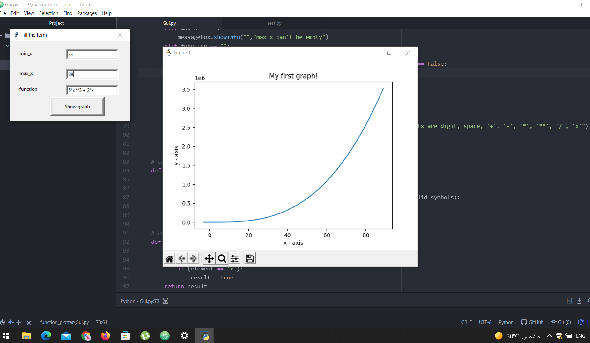

# Function_Plotter
To run the program simply run Gui.py file. After that a form will appear and you have to fill this form with min_x and max_x which are
the x_axis range in the graph and then fill the function which is the y-axis in the graph and then click "Show graph" which will draw the graph 
on the screen.

Some of working and wrong examples are shown below. 

